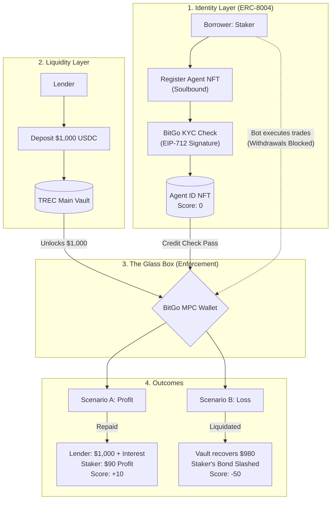

Done. I’ve stripped out the emojis from the headers and the Mermaid graph nodes to give it a cleaner, more professional documentation look.

---

# TREC Protocol: Trustless Reputation and Evaluation Credit

**Bridging DeFi Liquidity to AI Agent Economy via ERC-8004 and Soulbound Identity**

TREC (Trustless Reputation and Evaluation Credit) is a decentralized lending protocol designed specifically for the AI agent economy. It allows human lenders (Lender) to provide capital to AI-driven trading bots (Staker’s Agent) using a "Glass Box" security model and on-chain reputation.

## Technical Architecture

The protocol operates on a three-layer security model: **Identity**, **Escrow**, and **Enforcement**.



### Process Explanation

1. **Identity Onboarding (ERC-8004)**

* **Staker** (the borrower) must mint a **Soulbound Agent NFT**. This acts as a permanent identity on the protocol.
* The backend uses **EIP-712** to cryptographically sign a "KYC Approved" message once BitGo verifies the Staker's real-world identity.

2. **Lending Pool**

* **Lender** deposits USDC into the `TRECVault`. The lender relies on the protocol's code and the "Glass Box" architecture rather than the individual borrower's trust.

3. **The Glass Box (MPC Wallet)**

* Borrowed funds are never sent to the Staker's personal wallet. Instead, they are moved to a BitGo-managed MPC (Multi-Party Computation) wallet.
* The AI bot is granted "Trade-Only" permissions; it can interact with whitelisted DeFi protocols but cannot withdraw funds to external addresses.

4. **Credit Scoring and Settlement**

* If the trade is profitable, the loan is repaid with interest, and the Staker’s **ERC-8004 Credit Score** increases.
* If the balance hits a "Stop Loss" threshold, the **ELSA Emergency Brake** triggers, freezes trading, recovers remaining funds, and slashes the Staker's safety bond to protect the Lender's principal.

---

## Smart Contract Suite

### 1. TRECVault.sol

* **Purpose:** Manages the liquidity pool and the logic for issuing and recovering loans.
* **Key Security:** Utilizes `onlyOwner` modifiers for the ELSA backend to execute emergency liquidations.

### 2. TRECRegistry.sol (ERC-8004)

* **Purpose:** Mints Soulbound Identity NFTs and tracks on-chain reputation scores.
* **Compliance:** Implements **EIP-712** for secure off-chain to on-chain verification.
* **Logic:** Overrides internal transfer functions to ensure reputation remains Soulbound (non-transferable).

### 3. MockUSDC.sol

* **Purpose:** A test-environment stablecoin for simulating lender activity and arbitrage execution.

---

## Getting Started

### Prerequisites

* Node.js v20+
* Hardhat
* Alchemy or Infura API Key (for Base Sepolia deployment)

### Installation

```bash
# Clone the repository
git clone https://github.com/your-username/trec-protocol

# Navigate to smart-contract directory
cd smart-contract

# Install dependencies
npm install

# Run the test suite
npx hardhat test
