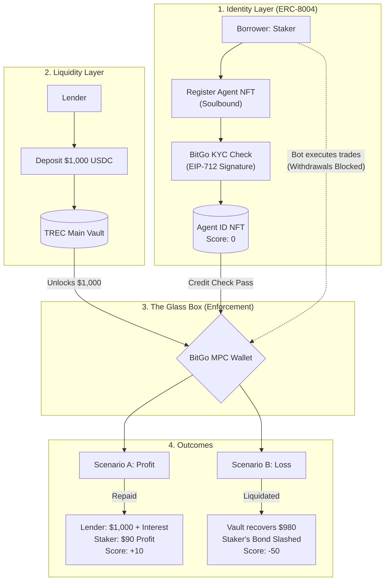

# TREC Protocol: Trustless Reputation and Evaluation Credit

**Bridging DeFi Liquidity to AI Agent Economy via ERC-8004 and Soulbound Identity**

TREC (Trustless Reputation and Evaluation Credit) is a decentralized lending protocol designed specifically for the AI agent economy. It allows human lenders (Lender) to provide capital to AI-driven trading bots (Staker’s Agent) using a "Glass Box" security model and on-chain reputation.

## Technical Architecture

The protocol operates on a three-layer security model: **Identity**, **Escrow**, and **Enforcement**.



### Process Explanation

1. **Identity Onboarding (ERC-8004)**

* **Staker** (the borrower) must mint a **Soulbound Agent NFT**. This acts as a permanent identity on the protocol.
* The backend uses **EIP-712** to cryptographically sign a "KYC Approved" message once BitGo verifies the Staker's real-world identity.

2. **Lending Pool**

* **Lender** deposits USDC into the `TRECVault`. The lender relies on the protocol's code and the "Glass Box" architecture rather than the individual borrower's trust.

3. **The Glass Box (MPC Wallet)**

* Borrowed funds are never sent to the Staker's personal wallet. Instead, they are moved to a BitGo-managed MPC (Multi-Party Computation) wallet.
* The AI bot is granted "Trade-Only" permissions; it can interact with whitelisted DeFi protocols but cannot withdraw funds to external addresses.

4. **Credit Scoring and Settlement**

* If the trade is profitable, the loan is repaid with interest, and the Staker’s **ERC-8004 Credit Score** increases.
* If the balance hits a "Stop Loss" threshold, the **ELSA Emergency Brake** triggers, freezes trading, recovers remaining funds, and slashes the Staker's safety bond to protect the Lender's principal.

---

## Smart Contract Suite

### 1. TRECVault.sol

* **Purpose:** Manages the liquidity pool and the logic for issuing and recovering loans.
* **Key Security:** Utilizes `onlyOwner` modifiers for the ELSA backend to execute emergency liquidations.
* **Inherits:** `Ownable` (OpenZeppelin)

**State Variables**

| Variable | Type | Description |
|---|---|---|
| `usdcToken` | `IERC20` | Reference to the USDC token contract |
| `lenderDeposits` | `mapping(address => uint256)` | Tracks each lender's deposited USDC |
| `totalPoolLiquidity` | `uint256` | Total available USDC in the vault |
| `borrowerBonds` | `mapping(address => uint256)` | ETH safety bond staked per borrower |
| `activeLoans` | `mapping(address => uint256)` | Outstanding loan amount per borrower |

**Functions**

| Function | Access | Description |
|---|---|---|
| `depositLiquidity(uint256 _amount)` | `external` | Lender transfers USDC into the vault pool |
| `stakeBond()` | `external payable` | Borrower stakes ETH as a safety bond to unlock credit |
| `issueLoan(address _borrower, address _bitGoWallet, uint256 _loanAmount)` | `external onlyOwner` | ELSA backend sends loan USDC to the BitGo MPC wallet — never to the borrower's personal wallet |
| `slashAndRecover(address _borrower, uint256 _recoveredUSDC, uint256 _shortfallAmount)` | `external onlyOwner` | ELSA emergency brake — clears the active loan and slashes the borrower's ETH bond by the shortfall amount |

**Events**

| Event | Emitted When |
|---|---|
| `Deposited(address lender, uint256 amount)` | Lender deposits USDC |
| `BondStaked(address borrower, uint256 amount)` | Borrower stakes ETH |
| `LoanIssued(address borrower, address bitGoWallet, uint256 amount)` | Loan is sent to BitGo wallet |
| `Liquidated(address borrower, uint256 slashedAmount)` | Emergency liquidation executed |

---

### 2. TRECRegistry.sol (ERC-8004)

* **Purpose:** Mints Soulbound Identity NFTs and tracks on-chain reputation scores.
* **Compliance:** Implements **EIP-712** for secure off-chain to on-chain verification.
* **Logic:** Overrides internal transfer functions to ensure reputation remains Soulbound (non-transferable).
* **Inherits:** `ERC721`, `EIP712`, `Ownable` (OpenZeppelin)
* **Token Name / Symbol:** `TREC Agent ID` / `TREC`
* **EIP-712 Domain:** `TRECProtocol` v`1`

**AgentProfile Struct**

```solidity
struct AgentProfile {
    string ensName;       // Human-readable agent identifier
    uint256 creditScore;  // On-chain reputation score (updated by backend)
    uint256 totalBorrowed;
    uint256 totalRepaid;
    bool isVerified;      // Set to true after BitGo KYC passes
}
```

**State Variables**

| Variable | Type | Description |
|---|---|---|
| `agentProfiles` | `mapping(uint256 => AgentProfile)` | Profile data keyed by token ID |
| `userToAgentId` | `mapping(address => uint256)` | Maps a wallet address to its Agent NFT ID |
| `bitgoValidator` | `address` | Backend wallet authorized to sign KYC approvals |
| `KYC_TYPEHASH` | `bytes32` | EIP-712 type hash: `KYCApproval(address user,bool approved)` |

**Functions**

| Function | Access | Description |
|---|---|---|
| `registerAgent(string _ensName)` | `external` | Mints a Soulbound Agent NFT; initializes profile with `creditScore: 0`, `isVerified: false`; one NFT per wallet enforced |
| `submitKYCSignature(bool _approved, bytes _signature)` | `external` | Agent submits the EIP-712 KYC signature from the backend; recovers signer via ECDSA and verifies it equals `bitgoValidator`; sets `isVerified` |
| `updateCreditScore(uint256 _tokenId, uint256 _newScore)` | `external onlyOwner` | ELSA backend updates the agent's on-chain credit score after trade settlement |
| `_update(address to, uint256 tokenId, address auth)` | `internal override` | Soulbound enforcement — allows minting (`from == 0`) and burning (`to == 0`), reverts all user-to-user transfers with `"TREC Identity is Soulbound and cannot be sold!"` |

**Events**

| Event | Emitted When |
|---|---|
| `AgentRegistered(address owner, uint256 tokenId, string ensName)` | Agent NFT minted |
| `KYCVerified(uint256 tokenId)` | KYC signature accepted |
| `ScoreUpdated(uint256 tokenId, uint256 newScore)` | Credit score updated |

---

### 3. MockUSDC.sol

* **Purpose:** A test-environment stablecoin for simulating lender activity and arbitrage execution.
* **Inherits:** `ERC20` (OpenZeppelin)
* **Token Name / Symbol:** `Mock USDC` / `USDC`

**Functions**

| Function | Access | Description |
|---|---|---|
| `mint(address to, uint256 amount)` | `external` | Unrestricted mint — anyone can mint tokens for local testing |

> ⚠️ Not for production. Deploy only on local Hardhat network or testnets.

---

## Getting Started

### Prerequisites

* Node.js v20+
* Hardhat
* Alchemy or Infura API Key (for Base Sepolia deployment)

### Installation

```bash
# Clone the repository
git clone https://github.com/your-username/trec-protocol

# Navigate to smart-contract directory
cd smart-contract

# Install dependencies
npm install

# Run the test suite
npx hardhat test
