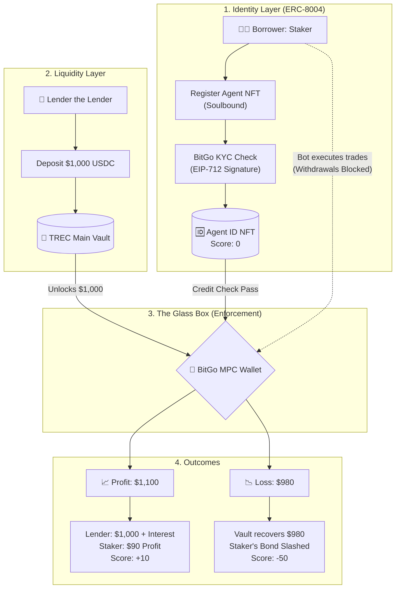

# 🛡️ TREC Protocol: Trustless Reputation & Evaluation Credit

**Bridging DeFi Liquidity to AI Agent Economy via ERC-8004 & Soulbound Identity**

TREC (Trustless Reputation & Evaluation Credit) is a decentralized lending protocol designed specifically for the AI agent economy. It allows human lenders (like **Lender**) to provide capital to AI-driven trading bots (like **Staker’s Agent**) using a "Glass Box" security model and on-chain reputation.

## 🏗️ Technical Architecture

The protocol operates on a three-layer security model: **Identity**, **Escrow**, and **Enforcement**.



### 📋 Process Explanation

1. **Identity Onboarding (ERC-8004):**
* **Staker** (the borrower) cannot just take money. He must mint a **Soulbound Agent NFT**. This is his permanent identity on the protocol.
* Our backend uses **EIP-712** to cryptographically sign a "KYC Approved" message only after BitGo verifies Staker's real-world identity.


2. **Lending Pool:**
* **Lender** (the lender) deposits USDC into the `TRECVault`. He doesn't need to know Staker; he trusts the protocol's code and the "Glass Box" architecture.


3. **The Glass Box (MPC Wallet):**
* This is the core innovation. The borrowed $1,000 is **never** sent to Staker's personal wallet. Instead, it is moved to a BitGo-managed MPC (Multi-Party Computation) wallet.
* Staker’s AI bot is granted "Trade-Only" permissions. It can buy and sell on Uniswap, but it **cannot withdraw** the funds to an external address.


4. **Credit Scoring & Settlement:**
* If the bot makes a profit, the loan is repaid with interest, and Staker’s **ERC-8004 Credit Score** increases.
* If the balance hits a "Stop Loss" (e.g., $980), our **ELSA Emergency Brake** triggers, freezes the trades, recovers the remaining funds, and slashes Staker's safety bond to make Lender whole.


---

## 💻 Smart Contract Suite

### 1. `TRECVault.sol`

* **Purpose:** Manages the pool of funds and the logic for issuing/recovering loans.
* **Key Security:** Uses `onlyOwner` modifiers for the ELSA backend to prevent unauthorized liquidations.

### 2. `TRECRegistry.sol` (ERC-8004)

* **Purpose:** Mints Soulbound Identity NFTs and tracks credit scores.
* **Compliance:** Implements **EIP-712** for off-chain to on-chain verification.
* **Logic:** Overrides `_update` to prevent the transfer of reputation (Soulbound).

### 3. `MockUSDC.sol`

* **Purpose:** A test-environment stablecoin for simulating lender deposits and arbitrage trades.

---

## 🚀 Getting Started

### Prerequisites

* Node.js v20+
* Foundry or Hardhat
* Alchemy/Infura API Key (for Base Sepolia deployment)

### Installation

```bash
# Clone the repo
git clone https://github.com/your-username/trec-protocol

# Install Smart Contract dependencies
cd smart-contract
npm install

# Run Tests
npx hardhat test
